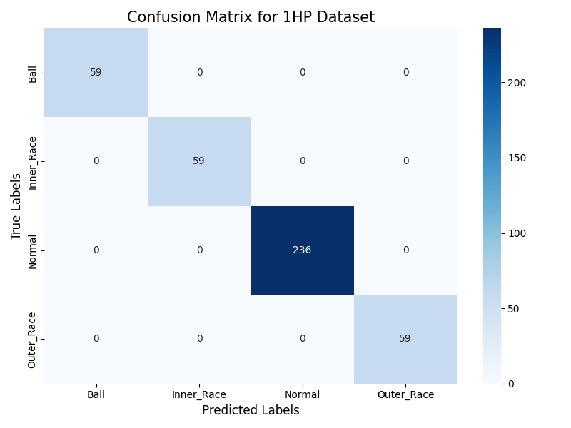

# ⚙️ Bearing Fault Diagnosis System (Predictive Maintenance)

An end-to-end Machine Learning pipeline for industrial bearing fault detection using vibration signal analysis. The system extracts domain-specific statistical features from raw time-series data to accurately identify bearing defects under different operating conditions.

---

## 📌 Project Overview
In industrial machinery, undetected bearing failures lead to catastrophic downtime. This project simulates an automated **Condition Monitoring** workflow:
- Processes raw acceleration signals from the **CWRU Bearing Dataset**.
- Converts time-series vibration into meaningful statistical health indicators.
- Classifies operational states: **Normal**, **Ball Fault**, **Inner Race Fault**, and **Outer Race Fault**.

---

## 🛠 Key Features & Methodology
- **Domain-Specific Feature Engineering:** Extracted statistical indicators including:
  - RMS (Energy/Vibration amplitude)
  - Kurtosis (Impulsiveness & shock detection)
  - Skewness (Waveform asymmetry)
  - Crest Factor (Peak severity)
  - Peak Frequency (Dominant spectral component)
- **Robust Pipeline:** Includes zero-leakage scaling (`StandardScaler`) and multi-class encoding (`LabelEncoder`).
- **Classification Engine:** Powered by a tuned **Random Forest Classifier**.
- **Cross-Load Evaluation:** Evaluated on unseen operational loads (0HP to 1HP) to prove real-world generalization.

---

## 📊 Experimental Results

The confusion matrix below demonstrates model generalization evaluated on the **1HP load condition**:

> **Key Takeaway:** The model demonstrates high recall across all fault categories, validating that statistical features can reliably separate complex vibration patterns.

---

## 🚀 Quick Start
git clone https://github.com/mahdim7896-alt/Bearing-Fault-Diagnosis-Predictive-Maintenance-System.git
cd Bearing-Fault-Diagnosis-Predictive-Maintenance-System

